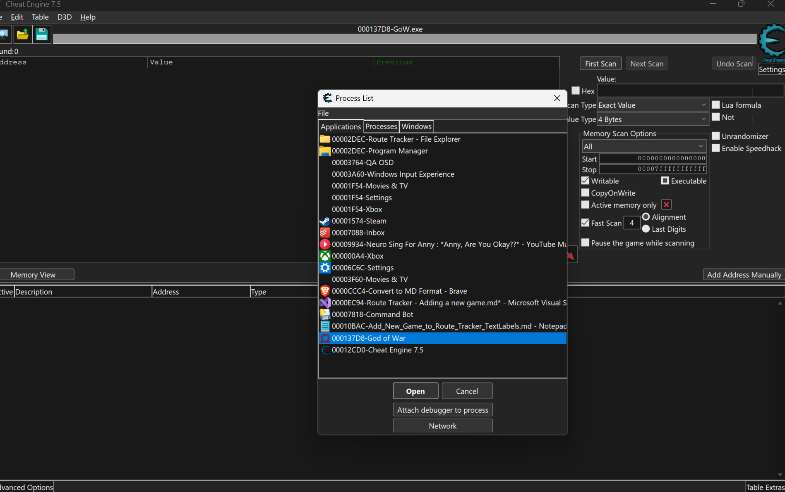
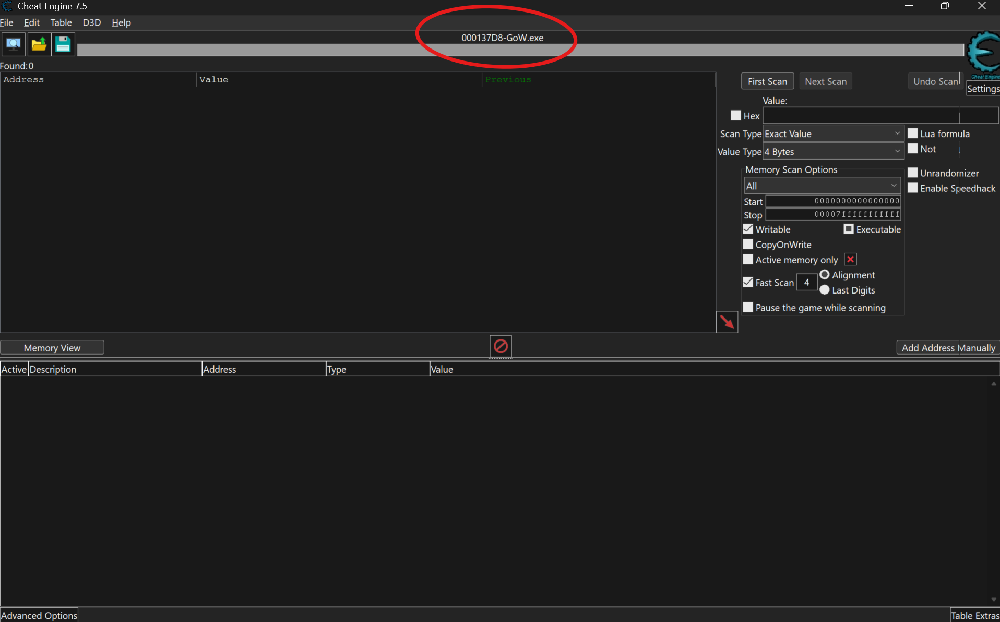
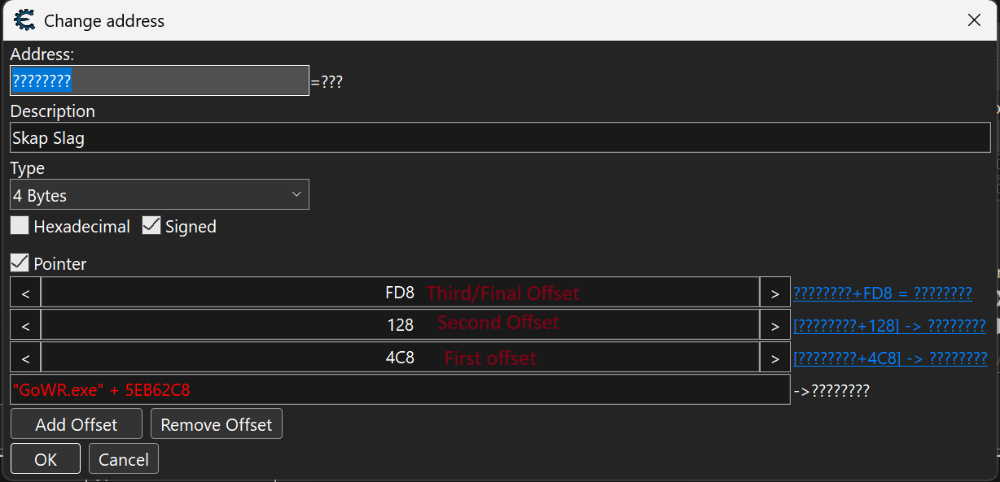

# How to Add a New Game to Route Tracker (Beginner-Friendly, Full Example)

This guide walks you through adding a new game—using God of War 2018 as an example—to Route Tracker.

It covers everything: memory pointers, code changes, UI, settings, and route file structure.

No prior experience required!

---

[Target] 1. Gather What You Need

Before you start, make sure you have:

• Game executable name (for God of War 2018, it's GoW.exe)

• Memory pointers/offsets for each collectible or stat you want to track (e.g., ravens, chests, artifacts)

• Route file data listing all the items/collectibles you want to track (see step 7 for details)

[Tip] Use memory scanning tools like Cheat Engine to find memory addresses for collectibles.

---

[Tool] 2. Create the Game Stats Class

File: Route Tracker\GoW2018GameStats.cs

This class reads the game's memory and provides stats to the rest of the program.

```csharp
using System;
using System.Collections.Generic;
using System.Diagnostics;

namespace Route_Tracker
{
    public unsafe class GoW2018GameStats : GameStatsBase
    {
        // Example: memory offsets for collectibles (replace with real values)
        private readonly int[] ravenOffsets = { 0x123, 0x456, 0x789 };
        private readonly int[] chestOffsets = { 0xABC, 0xDEF, 0x101 };
        private readonly int[] artifactOffsets = { 0x222, 0x333, 0x444 };

        // Pre-calculated base address for collectibles
        private readonly nint collectiblesBaseAddress;

        public GoW2018GameStats(IntPtr processHandle, IntPtr baseAddress)
            : base(processHandle, baseAddress)
        {
            // Set up base addresses for memory reading
            this.collectiblesBaseAddress = (nint)baseAddress + 0x1000; // example offset
            Debug.WriteLine("GoW2018GameStats initialized");
        }

        // Override this method to provide game-specific stats
        public override Dictionary<string, object> GetStatsAsDictionary()
        {
            // Replace these with actual memory reads using your pointers
            int ravens = Read<int>((nint)baseAddress, ravenOffsets);
            int chests = Read<int>((nint)baseAddress, chestOffsets);
            int artifacts = Read<int>((nint)baseAddress, artifactOffsets);

            return new Dictionary<string, object>
            {
                ["Ravens"] = ravens,
                ["Chests"] = chests,
                ["Artifacts"] = artifacts,
                ["Game"] = "God of War 2018",
                // Add more stats as needed
            };
        }

        public override (bool IsLoading, bool IsMainMenu) GetGameStatus()
        {
            // Implement loading screen and main menu detection
            // For now, return false for both until you implement detection
            return (false, false);
        }
    }
}
```

What's happening here?

• You define memory pointers for each collectible/stat as int[] arrays

• GetStatsAsDictionary() reads values from memory and returns them in a dictionary

• GetGameStatus() detects loading screens or main menu (implement based on your game's memory structure)

---

[Link] 3. Update GameConnectionManager

File: Route Tracker\GameConnectionManager.cs

3.1 Update the DetectRunningGame() method

```csharp
public string DetectRunningGame()
{
    // Define known game processes and their friendly names
    Dictionary<string, string> gameProcessMap = new()
    {
        { "AC4BFSP", "Assassin's Creed 4" },
        { "GoW", "God of War 2018" }
        // Add more games here as needed
    };

    // Check for running processes that match our supported games
    foreach (var process in Process.GetProcesses())
    {
        try
        {
            // Check if this process name matches any of our supported games
            foreach (var game in gameProcessMap)
            {
                if (process.ProcessName.Contains(game.Key, StringComparison.OrdinalIgnoreCase))
                {
                    return game.Value; // Return the friendly game name
                }
            }
        }
        catch
        {
            // Skip any processes we can't access
            continue;
        }
    }

    return string.Empty; // No matching game found
}
```

3.2 Update the StartGame() method

```csharp
public void StartGame(string processName)
{
    try
    {
        string gameDirectory = string.Empty;
        if (currentProcess == "AC4BFSP.exe")
        {
            gameDirectory = Settings.Default?.AC4Directory ?? string.Empty;
        }
        else if (currentProcess == "GoW.exe")
        {
            gameDirectory = Settings.Default?.Gow2018Directory ?? string.Empty;
        }

        if (string.IsNullOrEmpty(gameDirectory))
        {
            MessageBox.Show("Please select the game's directory.");
            return;
        }

        string gamePath = System.IO.Path.Combine(gameDirectory, processName);
        if (!System.IO.File.Exists(gamePath))
        {
            MessageBox.Show($"The game executable was not found in the selected directory: {gamePath}");
            return;
        }

        var startInfo = new ProcessStartInfo
        {
            FileName = gamePath,
            UseShellExecute = true
        };
        Process.Start(startInfo);
    }
    catch (Exception ex)
    {
        MessageBox.Show($"Error starting the game: {ex.Message}");
    }
}
```

3.3 Update the InitializeGameStats() method

```csharp
public void InitializeGameStats(string gameName)
{
    if (processHandle != IntPtr.Zero && baseAddress != IntPtr.Zero)
    {
        // Create the correct stats object based on game
        gameStats = gameName switch
        {
            "Assassin's Creed 4" => new AC4GameStats(processHandle, baseAddress),
            "God of War 2018" => new GoW2018GameStats(processHandle, baseAddress),
            _ => throw new NotSupportedException($"Game {gameName} is not supported")
        };

        gameStats.StatsUpdated += OnGameStatsUpdated;
        gameStats.StartUpdating();
    }
}
```

3.4 Update the ConnectToGameAsync() method

```csharp
public async Task<bool> ConnectToGameAsync(string gameName, bool autoStart = false)
{
    // Set the correct process name based on game selection
    if (gameName == "Assassin's Creed 4")
        currentProcess = "AC4BFSP.exe";
    else if (gameName == "God of War 2018")
        currentProcess = "GoW.exe";
    else
        return false; // Invalid game selection

    // Auto-start the game if requested and not already running
    if (autoStart)
    {
        if (!IsProcessRunning(currentProcess))
        {
            StartGame(currentProcess);
            await WaitForGameToStartAsync();
        }
    }

    // Attempt to connect to the game process
    Connect();

    // Initialize game stats if connection was successful
    if (processHandle != IntPtr.Zero)
    {
        InitializeGameStats(gameName);
        return true;
    }

    return false;
}
```

Why these changes?

This tells the program which executable to look for, how to start the game, and which stats class to use when connecting.

---

[Settings] 4. Update SettingsManager

File: Route Tracker\SettingsManager.cs

4.1 Update GetGameDirectory() method

```csharp
public string GetGameDirectory(string game)
{
    if (game == "Assassin's Creed 4")
        return Settings.Default.AC4Directory;
    else if (game == "God of War 2018")
        return Settings.Default.Gow2018Directory;
    return string.Empty;
}
```

4.2 Update SaveDirectory() method

```csharp
public void SaveDirectory(string selectedGame, string directory)
{
    if (selectedGame == "Assassin's Creed 4")
    {
        Settings.Default.AC4Directory = directory;
    }
    else if (selectedGame == "God of War 2018")
    {
        Settings.Default.Gow2018Directory = directory;
    }
    Settings.Default.Save();
}
```

4.3 Update GetGamesWithDirectoriesSet() method

```csharp
public List<string> GetGamesWithDirectoriesSet()
{
    var games = new List<string>();
    var supportedGames = new[] { "Assassin's Creed 4", "God of War 2018" };
    foreach (var game in supportedGames)
    {
        if (!string.IsNullOrEmpty(GetGameDirectory(game)))
            games.Add(game);
    }
    return games;
}
```

Why these changes?

The program needs to know where your game is installed to launch it and attach to its process.

---

[UI] 5. Update UI Elements

5.1 Update GameDirectoryForm

File: Route Tracker\GameDirectoryForm.cs

Update the InitializeCustomComponents() method:

```csharp
private void InitializeCustomComponents()
{
    this.Text = "Game Directory Settings";
    this.Size = new System.Drawing.Size(400, 200);

    Label gameLabel = new()
    {
        Text = "Select Game:",
        Location = new System.Drawing.Point(20, 20)
    };
    this.Controls.Add(gameLabel);

    gameDropdown = new ComboBox();
    gameDropdown.Items.AddRange(new[] { "Assassin's Creed 4", "God of War 2018" });
    gameDropdown.Location = new System.Drawing.Point(120, 20);
    gameDropdown.SelectedIndexChanged += GameDropdown_SelectedIndexChanged;
    this.Controls.Add(gameDropdown);

    // ... rest of the method remains the same
}
```

Also update the GameDropdown_SelectedIndexChanged method:

```csharp
private void GameDropdown_SelectedIndexChanged(object? sender, EventArgs e)
{
    string selectedGame = gameDropdown.SelectedItem?.ToString() ?? string.Empty;
    if (selectedGame == "Assassin's Creed 4")
    {
        directoryTextBox.Text = Settings.Default.AC4Directory;
    }
    else if (selectedGame == "God of War 2018")
    {
        directoryTextBox.Text = Settings.Default.Gow2018Directory;
    }
}
```

5.2 Update MainForm Connection Controls

File: Route Tracker\MainForm.cs

Update the CreateConnectionControls method:

```csharp
private void CreateConnectionControls(MenuStrip menuStrip)
{
    // Create and configure the connection label
    ToolStripLabel connectionLabel = new()
    {
        Text = "Not connected"
    };
    menuStrip.Items.Add(connectionLabel);

    // Create and configure the game dropdown
    ToolStripComboBox gameDropdown = new();
    gameDropdown.Items.AddRange(new[] { "", "Assassin's Creed 4", "God of War 2018" });
    gameDropdown.SelectedIndex = 0;
    menuStrip.Items.Add(gameDropdown);

    // ... rest of the method remains the same
}
```

Why these changes?

This lets users select your new game from the UI dropdowns and menus.

---

[SettingsProperty] 6. Add Settings Property

In your application settings (Settings.settings or Settings.Designer.cs), add a new property:

```csharp
[global::System.Configuration.UserScopedSettingAttribute()]
[global::System.Diagnostics.DebuggerNonUserCodeAttribute()]
[global::System.Configuration.DefaultSettingValueAttribute("")]
public string Gow2018Directory {
    get {
        return ((string)(this["Gow2018Directory"]));
    }
    set {
        this["Gow2018Directory"] = value;
    }
}
```

Alternative: You can add this through Visual Studio's Settings editor:

• Name: Gow2018Directory

• Type: string

• Scope: User

• Value: (empty)

---

[RouteFile] 7. Create a Route File

Folder: Routes/

File name: God of War 2018 100 % Route - Main Route.tsv

File Structure

Each line is a tab-separated value (TSV) with these columns:

| Name/Hint         | Type        | Number | Coordinates (Optional)   |
|-------------------|-------------|--------|-------------------------|
| Raven #1          | Raven       | 1      | Midgard - Wildwoods     |
| Nornir Chest #1   | Chest       | 1      | Midgard - River Pass    |
| Artifact #1       | Artifact    | 1      | Midgard - Lookout Tower |

Example File Content:

```tsv
Raven #1	Raven	1	Midgard - Wildwoods
Nornir Chest #1	Chest	1	Midgard - River Pass
Artifact #1	Artifact	1	Midgard - Lookout Tower
Legendary Chest #1	Chest	2	Midgard - Witch's Cave
Raven #2	Raven	2	Midgard - The River Pass
```

Column Definitions

• Name/Hint: What the player is looking for (displayed in the UI)

• Type: The type of collectible (must match what your code checks for)

• Number: Unique ID for that collectible (used for progress tracking)

• Coordinates: (Optional) Location information for the player

---

[RouteManager] 8. Update RouteManager (If Needed)

File: Route Tracker\RouteManager.cs

If your new game has unique collectible types, update the CheckCompletion method:

```csharp
private bool CheckCompletion(RouteEntry entry, GameStatsEventArgs stats)
{
    if (string.IsNullOrEmpty(entry.Type))
        return false;

    string normalizedType = entry.Type.Trim();

    return normalizedType switch
    {
        // Assassin's Creed 4 types
        "Viewpoint" or "viewpoint" => stats.GetValue<int>("Viewpoints", 0) >= entry.Condition,
        "Chest" or "chest" => stats.GetValue<int>("Chests", 0) >= entry.Condition,
        
        // God of War 2018 types
        "Raven" or "raven" => stats.GetValue<int>("Ravens", 0) >= entry.Condition,
        "Artifact" or "artifact" => stats.GetValue<int>("Artifacts", 0) >= entry.Condition,
        
        // Add more types as needed
        _ => false,
    };
}
```

Why this change?

This function matches the route file's "Type" column to the correct stat in your code, enabling automatic completion detection.

---

[Testing] 9. Testing Your Implementation

Step-by-Step Testing

1. Build and run the application

2. Open Settings > Game Directory

3. Select "God of War 2018" and set its installation directory

4. Start God of War 2018

5. In Route Tracker, use "Connect to Game" or let auto-detect find it

6. Verify that:

• Stats are updating in the Game Stats window

• Route entries load from your TSV file

• Items are marked complete when you collect them in-game

Debugging Checklist

• [ ] Game executable name matches exactly (GoW.exe)

• [ ] Memory addresses are correct for your game version

• [ ] Route file is properly formatted (tab-separated, not spaces)

• [ ] Collectible types in route file match the switch statement

• [ ] Settings directory is set correctly

---

[Checklist] 10. Complete Implementation Checklist

• [ ] Create GoW2018GameStats.cs with proper memory reading

• [ ] Add all pointer offsets for collectibles/stats

• [ ] Update GameConnectionManager.DetectRunningGame()

• [ ] Update GameConnectionManager.StartGame()

• [ ] Update GameConnectionManager.InitializeGameStats()

• [ ] Update GameConnectionManager.ConnectToGameAsync()

• [ ] Update SettingsManager.GetGameDirectory()

• [ ] Update SettingsManager.SaveDirectory()

• [ ] Update SettingsManager.GetGamesWithDirectoriesSet()

• [ ] Add game to GameDirectoryForm dropdown

• [ ] Add game to MainForm connection controls

• [ ] Add Gow2018Directory setting property

• [ ] Create route TSV file with proper format

• [ ] Update RouteManager.CheckCompletion() if needed

• [ ] Test the complete workflow

---

[RouteFileFormat] 11. Route File Format Reference

AC4 vs GoW Example Comparison

Assassin's Creed 4:

```tsv
Havana Viewpoint 1	Viewpoint	1	Havana
Havana Chest 1	Chest	1	Havana
```

God of War 2018:

```tsv
Raven #1	Raven	1	Midgard - Wildwoods
Nornir Chest #1	Chest	1	Midgard - River Pass
```

Important Notes

• Use tabs (not spaces) to separate columns

• The "Type" column must exactly match your switch statement cases

• Numbers should be sequential for each type of collectible

• Coordinates are optional but helpful for players

---

[AdvancedFeatures] 12. Advanced Features (Optional)

Once basic functionality works, you can enhance your implementation:

Memory Reading Enhancements

• Implement pointer chains for more complex memory structures

• Add support for dynamic base addresses

• Implement memory validation to detect game updates

UI Improvements

• Add game-specific icons or themes

• Create custom stats windows for your game

• Add coordinate-based maps or location hints

Route Features

• Create multiple route files for different categories

• Add route difficulty ratings or time estimates

• Implement route sharing and import/export

• Add images when hovering over a route entry so people know where to find it

---

[Troubleshooting] 13. Troubleshooting Common Issues

Game Not Detected

• Verify the exact process name using Task Manager or cheat engine see image below for example



• Check if the game requires administrator privileges

• Ensure the executable name in DetectRunningGame() is correct

Stats Not Updating

• Confirm memory addresses are correct for your game version

• Check if the game uses anti-cheat that blocks memory reading

• Verify pointer paths and offsets

• make sure that you put the offsets in the order in of image below


Route File Not Loading

• Check file format (TSV with tabs, not spaces)

• Verify file is in the correct Routes/ folder

• Ensure column count and types match expectations

Connection Issues

• Run Route Tracker as administrator if needed

• Check Windows Defender or antivirus blocking

• Verify game directory path is set correctly

---

[Congrats] 14. Congratulations!

You've successfully added God of War 2018 to Route Tracker. The same process can be applied to add any other game with the appropriate memory addresses and route data.

For questions or issues, check the existing code comments or create an issue on the project's GitHub repository.

